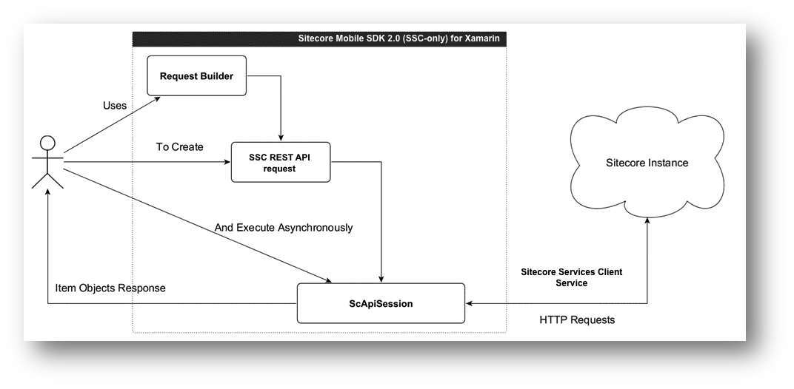

The Mobile SDK 2.0 (SSC-only) serves as an interface that connects the
Sitecore Services Client REST service with an application that lets
users work with Sitecore items and their fields. Although the Mobile SDK
2.0 (SSC-only)uses a RESTful request-response model, it lets developers
work at a higher level of abstraction than HTTP requests and JSON
responses.

To retrieve Sitecore content, you build an [SSC request
object](373D2141-9C63-40C6-A904-877B96AA89F8), send the request using
the [session object](584A8568-AB80-4323-AA48-924720E3C18D), and wait for
the response.

The diagram represents the process of accessing Sitecore content using
the SSC SDK:

{width="6.493055555555555in" height="3.1875in"}

To process requests asynchronously, the Mobile SDK 2.0 (SSC-only) uses
the async and await features of the .NET 4.5 Runtime. This enables the
processing of all the requests using the same operation flow, which
consists of the following steps:

-   Authenticating

-   Constructing an HTTP request

-   Networking

-   Parsing the response data

The Mobile SDK 2.0 (SSC-only) does not cache the content downloaded from
a Sitecore instance. You should implement your own persistence logic for
your application.
