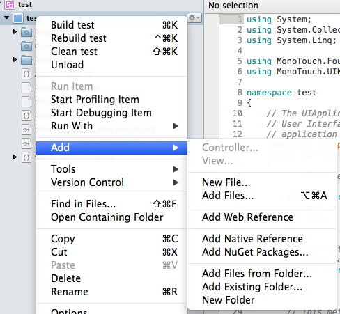

This topic describes how to include the Mobile SDK 2.0 (SSC-only)
component from the Xamarin Component Store in a project using Xamarin
Studio. The instructions apply to both Android and iOS platform.

Note

To install components from the Xamarin Component Store, you must first
connect Xamarin Studio or Visual Studio to your Xamarin account.

To install the Sitecore Mobile SDK from the Xamarin Component Store in
Xamarin Studio:

1.  On the toolbar, click **Project** and then click **Get More
    Components**.

    {width="3.48in" height="3.1in"}

2.  In the **All Components** dialog box, in the search field, enter the
    “**Sitecore Mobile SDK 2.0 (SSC-only) for Xamarin**”.

    {width="1.7in"
    height="3.4684984689413825in"}

3.  In the search results, select *“***Sitecore Mobile SDK
    2.0 (SSC-only) for Xamarin***”* and click **Add to App**.

When the package is downloaded, you can use the SSC SDK in your project.
