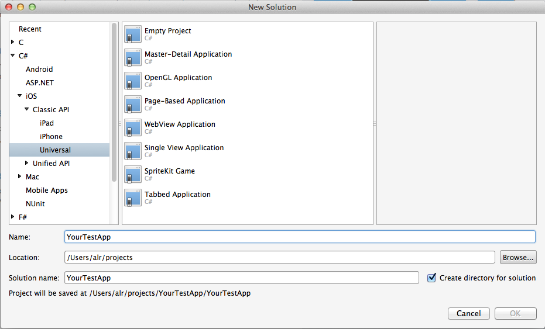
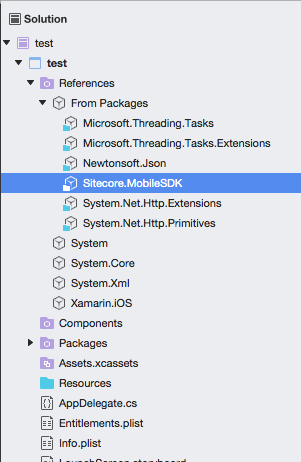

Before you can start using the Mobile SDK 2.0 (SSC-only), you must add
its assembly reference to a dependent project. This topic describes how
to install the Mobile SDK 2.0 (SSC-only) using NuGet and create an
Android application in Microsoft Visual Studio.

Note

Ensure that you have also installed Xamarin Studio and that you have
activated the installation with your Xamarin account.

To build an Android application using the Mobile SDK 2.0 (SSC-only) in
Microsoft Visual Studio:

1.  To create a project in Visual Studio, in the **New Project** wizard,
    click **Visual C\#, Android, Blank App (Android)**.

    {width="6.02in" height="4.15in"}

2.  To add the permission for accessing network resources to the Android
    manifest file, in the **Solution Explorer**, right-click the project
    and select **Properties**.

3.  In the **Project Designer** window, click **Android Manifest**, and
    in the **Required permissions** list box, select **Internet**.

    {width="4.48in" height="4.48in"}

4.  To add the Mobile SDK 2.0 (SSC-only) packages to your solution, on
    the toolbar, сlick **Project** and then click **Manage NuGet
    Packages**.

    {width="4.73in" height="3.78in"}

5.  In the **Manage NuGet Packages** dialog box, in the search field,
    enter the Sitecore.MobileSDK ID. The ID is not case-sensitive.

6.  In the search results, select Sitecore Mobile SDK 2.0 (SSC-only) for
    Xamarin and click **Install**.

7.  When the packages are added, you can see them in the *References*
    folder of the project in the **Solution Explorer**.

    {width="2.51in" height="3.43in"}

Now you can use the Mobile SDK 2.0 (SSC-only). To build a sample
application, add the following lines to the MainActivity.cs file:

namespace YourProjectName

{

using Android.App;

using Android.Content;

using Android.OS;

using Sitecore.MobileSDK.API;

using Sitecore.MobileSDK.API.Items;

using Sitecore.MobileSDK.PasswordProvider

using Sitecore.MobileSDK.API.Request.Parameters;

\[Activity(Label = "YourProjectName", MainLauncher = true, Icon =
"@drawable/icon")\]

public class MainActivity : Activity

{

protected async override void OnCreate(Bundle bundle)

{

base.OnCreate(bundle);

string instanceUrl = "http://my.site.com";

using (var demoCredentials = new
ScUnsecuredCredentialsProvider("username", "pass", "domain"))

using

(

var session =

SitecoreSSCSessionBuilder.AuthenticatedSessionWithHost(instanceUrl)

.Credentials(demoCredentials)

.DefaultDatabase("web")

.DefaultLanguage("en")

.MediaLibraryRoot("/sitecore/media library")

.MediaPrefix("\~/media/")

.DefaultMediaResourceExtension("ashx")

.BuildReadonlySession())

{

var request =

ItemSSCRequestBuilder.ReadItemsRequestWithPath("/sitecore/content/home")

.Build();

var readHomeItemTask = session.ReadItemAsync(request);

// cannot use "await" in main

Task.WaitAll(readHomeItemTask);

ScItemsResponse items = readHomeItemTask.Result;

string fieldText = items\[0\]\["Text"\].RawValue;

var dialogBuilder = new AlertDialog.Builder(this);

dialogBuilder.SetTitle(items\[0\].DisplayName);

dialogBuilder.SetMessage(fieldText);

dialogBuilder.SetPositiveButton("OK", (object sender,
DialogClickEventArgs e) =&gt; { });

dialogBuilder.Create().Show();

}

}

}

}

When it launches, the application displays an alert with the
corresponding item name and field value.

{width="2.41in" height="4.01in"}

Note

If you get this error:

*Deployment failed because the device does not support the package's
minimum Android version. You can change the minimum Android version in
the Android Application section of the Project Options.*

Open the Project Designer using the **Properties** command on the
**Project** menu, and on the **Application** tab, change the *Minimum
Android to target* setting to *Android 4.0.*
