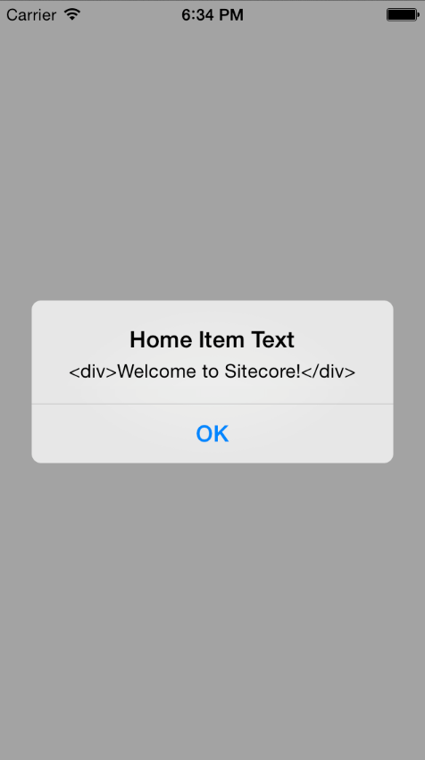

Before you can start using the Mobile SDK 2.0 (SSC-only), you must add
its assembly reference to a dependent project. This topic describes how
to install the *Sitecore Mobile SDK 2.0 (SSC-only) for Xamarin* using
NuGet and create an iOS application in Xamarin Studio on Mac.

Note

To become familiar with the fundamentals of iOS application development
with Xamarin, visit
<http://developer.xamarin.com/guides/ios/getting_started/hello,_iOS/>.

To build an iOS application using the *Sitecore Mobile SDK 2.0
(SSC-only) for Xamarin* in Xamarin Studio on Mac:

1.  To create a project in Xamarin Studio, in the **New Solution**
    wizard, click **iOS, Classic API** or **Unified API** for a 64 bit
    application**, Universal**, **Single View Application**.

    {width="5.82in" height="3.52in"}

2.  To add the Mobile SDK 2.0 (SSC-only)packages to your solution, in
    the **Solution Pad**, right-click the project node, click **Add,**
    **Add NuGet Packages**.

    {width="3.57in" height="3.3in"}

3.  In the **Add Packages** dialog box, in the search field, enter the
    Sitecore.MobileSDK ID. The ID is not case-sensitive.

4.  In the search results, select *Sitecore Mobile SDK 2.0 (SSC-only)
    for Xamarin* and click **Add Packages**.

    {width="4.790991907261592in"
    height="3.1666666666666665in"}

    When the NuGet packages are added, you can see the updated
    project references.

    {width="1.8731069553805775in"
    height="2.875in"}

5.  In the editor, add the following code to the ViewDidAppear()
    function of your application:

public override async void ViewDidAppear(bool animated)\
{\
base.ViewDidAppear(animated);

string instanceUrl = "http://my.site.com";

using (var demoCredentials = new ScUnsecuredCredentialsProvider
("login", "password", "domain"))

using

(

var session =

SitecoreSSCSessionBuilder.AuthenticatedSessionWithHost(instanceUrl)

.Credentials(demoCredentials)

.DefaultDatabase("web")

.DefaultLanguage("en")

.MediaLibraryRoot("/sitecore/media library")

.MediaPrefix("\~/media/")

.DefaultMediaResourceExtension("ashx")

.BuildReadonlySession())

{

var request =

ItemSSCRequestBuilder.ReadItemsRequestWithPath("/sitecore/content/home")

.Build();

ScItemsResponse items = await session.ReadItemAsync(request);

string fieldContent = items\[0\]\["Text"\].RawValue;

UIAlertView alert = new UIAlertView(

"Home Item Demo",

fieldContent,

null,

"Ok",

null);

alert.Show();

}\
}

1.  Add the following namespaces to your project to make the code
    compile correctly:

using System;

using System.Drawing;

using System.Threading.Tasks;

using Foundation;

using UIKit;

using Sitecore.MobileSDK.API;

using Sitecore.MobileSDK.API.Items;

using Sitecore.MobileSDK.API.Request.Parameters;

using Sitecore.MobileSDK.PasswordProvider

When it launches, the application displays an alert with the contents of
the **Text** field of the *Home* item.

{width="2.48in" height="4.43in"}
