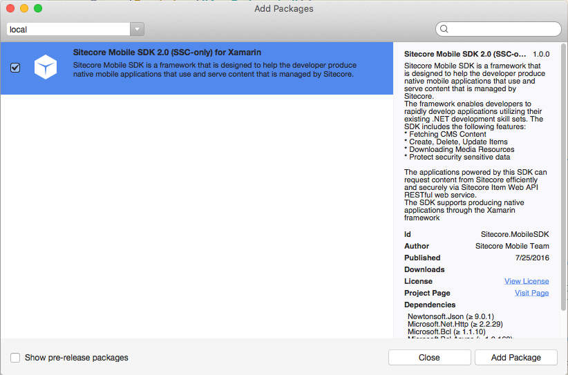

Before you can start using the Mobile SDK 2.0 (SSC-only), you must add
its assembly reference to a dependent project. This topic describes how
to install the Mobile SDK 2.0 (SSC-only) using NuGet and create an
Android application in Xamarin Studio.

Note

Ensure that you have installed Xamarin Studio and activated the
installation with your Xamarin account.

To build an Android application using the SSC SDK in Xamarin Studio:

1.  To create a project in Xamarin Studio, in the **New Solution**
    wizard, click **C\#**, **Android,** **Android Application**.

    {width="5.9in" height="3.6in"}

2.  To add the permission for accessing network resources to the Android
    manifest file, in the **Solution Pad**, right-click the project and
    select **Options**.

3.  In the **Project Options** window, click **Android Application**,
    and in the **Required permissions** list box, select **Internet**.

    {width="5.7in" height="3.89in"}

4.  To add the Mobile SDK 2.0 (SSC-only)packages to your solution, on
    the toolbar, click **Project** and then click **Add NuGet
    Packages**.

    {width="2.86in" height="3.01in"}

5.  In the **Add Packages** dialog box, in the search field, enter the
    Sitecore.MobileSDK ID. The ID is not case-sensitive.

6.  In the search results, select *Sitecore Mobile SDK 2.0 (SSC-only)
    for Xamarin* and then click **Add Package**.

    When the packages are added, you can see them in the *Packages*
    folder of the project in the **Solution Pad**.

    {width="1.75in" height="2.74in"}

Now you can use the Mobile SDK 2.0 (SSC-only). To build a sample
application, use the following code example:

using System;\
using Android.App;\
using Android.Content;\
using Android.OS;\
using Android.Runtime;\
using Android.Views;\
using Android.Widget;\
using Sitecore.MobileSDK.API;

using Sitecore.MobileSDK.API.Items;

using Sitecore.MobileSDK.API.Session;

using Sitecore.MobileSDK.PasswordProvider;\
\
namespace MobileSDKSample\
{\
  \[Activity (Label = "MobileSDKSample", MainLauncher = true, Icon = "@drawable/icon")\]\
  public class MainActivity : Activity\
  {\
      protected async override void OnCreate (Bundle bundle)\
      {\
          base.OnCreate (bundle);\
\
string instanceUrl = "http://my.site.com";

using (var credentials = new ScUnsecuredCredentialsProvider("login",
"password", "domain"))

using (

var session =

SitecoreSSCSessionBuilder.AuthenticatedSessionWithHost(instanceUrl)

.Credentials(credentials)

.DefaultDatabase("web")

.DefaultLanguage("en")

.MediaLibraryRoot("/sitecore/media library")

.MediaPrefix("\~/media/")

.DefaultMediaResourceExtension("ashx")

.BuildReadonlySession())

{

var request =

ItemSSCRequestBuilder.ReadItemsRequestWithPath("/sitecore/content/home")

.Build();

ScItemsResponse items = await session.ReadItemAsync(request);

string fieldContent = items\[0\]\["Text"\].RawValue;

    string itemName  = "Home Item Text";\
\
    var dialogBuilder = new AlertDialog.Builder (this);\
    dialogBuilder.SetTitle (itemName);\
    dialogBuilder.SetMessage (fieldText);\
    dialogBuilder.SetPositiveButton ("OK", (object sender, DialogClickEventArgs e) =&gt; {});\
\
    dialogBuilder.Create ().Show ();\
}

  }\
    }\
}

When it launches, the application displays an alert with the
corresponding item name and field value.

{width="2.42in" height="4.03in"}

Note

If you get this error:

*Deployment failed because the device does not support the package's
minimum Android version. You can change the minimum Android version in
the Android Application section of the Project Options.*

In the Android.Manifest.xml file, change the *Minimum Android version*
setting to *Android 4.0*.
