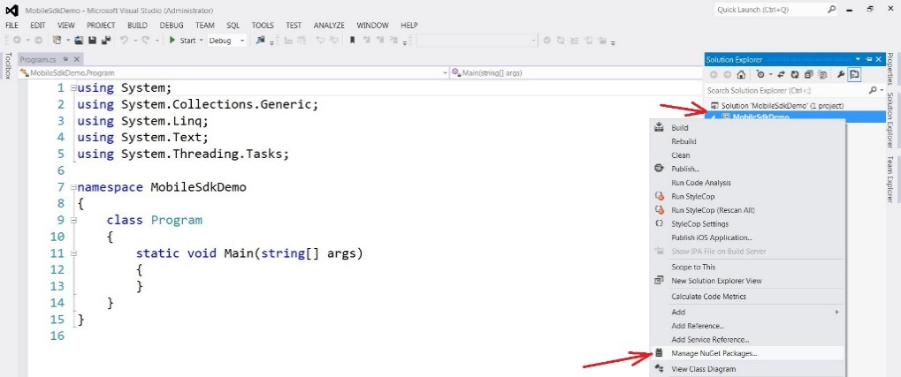

Before you can start using the Mobile SDK 2.0 (SSC-only), you must add
its assembly reference to a dependent project, either in your
application or in the class library. This topic describes the
NuGet-based setup for Microsoft Visual Studio.

To build a console application using the Mobile SDK 2.0 (SSC-only) in
Microsoft Visual Studio:

1.  Create a project in Visual Studio. You can create a desktop
    application, mobile application and others. This example describes
    how to create a console application.

    {width="4.56in" height="3.78in"}

2.  To install NuGet packages, in the **Solution Explorer** window,
    right-click the project node and click **Manage NuGet Packages**.

    {width="4.64in" height="1.94in"}

3.  In the **Manage NuGet Packages** dialog box, in the search field,
    enter the Sitecore.MobileSDK ID. The ID is not case-sensitive.

4.  In the search results, select Sitecore Mobile SDK 2.0 (SSC-only) for
    Xamarin and click **Install**. Accept the license agreements
    when prompted.

    When the NuGet package is installed, you can see the updated project
    references in the **Solution Explorer**.

    {width="1.77in" height="2.82in"}

5.  In the Visual Studio **Code Editor**, add the following code to
    the Main() function of your application:

private static void Main(string\[\] args)

{

string instanceUrl = "http://my.site.com";

using (var demoCredentials = new
ScUnsecuredCredentialsProvider("username", "pass", "domain"))

using

(

var session =

SitecoreSSCSessionBuilder.AuthenticatedSessionWithHost(instanceUrl)

.Credentials(demoCredentials)

.DefaultDatabase("web")

.DefaultLanguage("en")

.MediaLibraryRoot("/sitecore/media library")

.MediaPrefix("\~/media/")

.DefaultMediaResourceExtension("ashx")

.BuildReadonlySession())

{

var request =

ItemSSCRequestBuilder.ReadItemsRequestWithPath("/sitecore/content/home")

.Build();

var readHomeItemTask = session.ReadItemAsync(request);

// cannot use "await" in main

Task.WaitAll(readHomeItemTask);

ScItemsResponse items = readHomeItemTask.Result;

string fieldText = items\[0\]\["Text"\].RawValue;

Console.Clear();

Console.WriteLine("Home Item Text");

Console.WriteLine();

Console.WriteLine(fieldText);

Console.ReadKey();

}

}

1.  Add the following namespaces to your project to ensure that the code
    compiles properly:

using System;

using System.IO;

using System.Threading.Tasks;

using Sitecore.MobileSDK.API;

using Sitecore.MobileSDK.API.Items;

using Sitecore.MobileSDK.API.MediaItem;

using Sitecore.MobileSDK.API.Request.Parameters;

using Sitecore.MobileSDK.PasswordProvider

A sample output of the application:

{width="5.3in" height="1.02in"}
